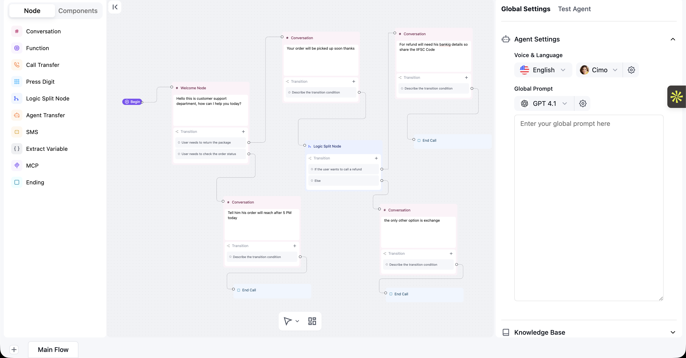

# Multi‑Prompt Agent (LiveKit, Python)

Backend implementation of a dynamic, modular multi‑prompt agent using
[LiveKit Agents for Python](https://github.com/livekit/agents) and
[LiveKit Cloud](https://cloud.livekit.io/). This repo focuses on the
multi‑prompt logic, dynamic configuration, and clean backend architecture.

What you’ll find here:

- Modular backend for multi‑prompt agents (no UI required)
- JSON schemas and sample configs for multiple “customers”
- Dynamic prompt routing and injection at runtime
- Voice/console runtimes via LiveKit.

## Thought process and assumptions

I tried three ways to build the multi‑prompt agent and kept the one that worked
best overall:

- LiveKit Workflows (chosen): Most predictable conversation flow with a good
  balance of speed and reliability. The node + orchestrator model made it easy
  to see what happens next and why. This is the default path in this repo.

- LangGraph: Very fast and the graph tools are great. In longer chats I saw the
  flow get less consistent at times, which would need more guardrails to keep it
  on track.

- Custom Multi‑Node Router: Gives you the most control. It started out a bit
  slower (latency) but I expect it to improve with production tuning (streaming,
  caching, batching). It’s a strong option if you need custom behavior.

A few simple assumptions behind the design:

- Each “step” is a node. We move between nodes based on easy‑to‑read rules
  (checked in `utils/expr_evaluator.py`).
- Prompts are filled with the current state right before we call the model
  (`src/agents/prompt_renderer.py`).
- You can run everything in text‑only console mode; voice is optional.
- Adding a new customer should only require a new config file, not code changes.
- Tools are referenced by name in the configs and implemented in code (see
  `src/agents/builtin_tools.py`).

This keeps the system easy to read, test, and extend while still letting you
pick the orchestration style that fits your needs.

## Assumptions Made

- I had to build something like this for agents as discussed in the interview
  

- I had to just build the livekit version with workflows but also try something
  else if possible
- I did not need to put the hard configs like model type, voices and other basic
  stuff in the config json for now, could be easily done later if required
- The config schema design was completely for this conversational flow or multi
  node /multi prompt agent.
- This whole task is built upon livekit sdk starter which was allowed to use.
  Could setup a custom one as well but didn't do cause wanted to finish this
  asap and the feature was the core requirement not the codebase.

## Architecture overview

At a glance, the system supports three orchestration styles that all implement
dynamic, multi‑prompt behavior:

- Multi‑Node Router: `src/agents/multi_node_router.py` orchestrates node agents
  with conditional transitions and tool calls.
- Workflow Engine: `src/workflows/` defines node agents and an orchestrator for
  branching, prompt switching, and stateful progression.
- LangGraph Flows: `src/langgraph_flows/` builds a graph of nodes/transitions
  with explicit schemas for inputs/outputs.

Key components used by all modes:

- LLM & TTS/STT integration: `src/agents/llm_provider.py`,
  `src/agents/tts_service.py`
- Prompt assembly: `src/agents/prompt_renderer.py`
- State & transitions: `src/agents/state_machine.py`,
  `src/utils/expr_evaluator.py`
- Execution glue: `src/agents/node_executor.py`, `src/agents/tool_invoker.py`
- Session & logging: `src/agents/session_manager.py`, `src/utils/logger.py`

### Approaches tried and findings

I implemented all three approaches to this assignment and compared them:

- LiveKit Workflows (chosen)

  - Best overall balance of performance and reliability
  - Explicit node agents + orchestrator make conversation flows predictable
  - Good development ergonomics and clear state/transition modeling
  - Used as the primary implementation for the assignment

- LangGraph Flows

  - Strong raw performance and great graph tooling/visualization
  - In practice, conversation flow reliability felt less consistent in my tests
    (transitions/order could be harder to keep deterministic for longer dialogs)

- Custom Multi‑Node Router
  - Maximum flexibility with fully custom routing and tools
  - Slightly higher latency out‑of‑the‑box; likely improves with production
    tuning (streaming/chunking, caching, batching, concurrency)
  - Promising path if you need fine‑grained control beyond the other two

How multi‑prompt works here:

1. A customer configuration declares prompts, tools, and transition conditions.
2. Incoming input (voice or text) updates state and context.
3. The router/graph selects the next prompt “node” based on conditions evaluated
   by `expr_evaluator` and node‑level logic.
4. Prompts are rendered with current state and injected context.
5. The chosen model/tool executes; the result advances the state along a
   configured edge.

## JSON schemas and customer configs

Schemas that define how configurations are structured live in `schemas/`:

- `schemas/multinode_schema.json` – For the multi‑node router mode
- `schemas/workflow_schema.json` – For the workflow engine mode
- `schemas/langgraph_schema.json` – For LangGraph flows

Sample customer configurations are included under `configs/`:

- `configs/workflows/` – Complete workflow definitions per customer
- `configs/langgraph/` – LangGraph flow definitions per customer
- `configs/custom_nodes/` – Reusable node/prompt fragments

Customers included: `ecommerce`, `healthcare`, `realestate`.

Minimal conceptual shape (example only):

```json
{
	"customer": "ecommerce",
	"entry_node": "welcome",
	"nodes": [
		{
			"id": "welcome",
			"prompt": "You are a helpful shopping assistant...",
			"tools": ["search_inventory"],
			"transitions": [
				{ "when": "intent == 'track_order'", "to": "order_status" },
				{ "when": "intent == 'faq'", "to": "faq" }
			]
		}
	]
}
```

Create a new customer by copying one of the provided configs, changing the
customer id, prompts, and transitions. Configs are validated against the schemas
above.

## Dev setup

Clone the repository and install dependencies to a virtual environment:

```console
# Ensure uv is installed first: https://github.com/astral-sh/uv (e.g. `pip install uv` or follow official docs)

cd multi-node-agent
uv sync
```

Sign up for [LiveKit Cloud](https://cloud.livekit.io/) then set up the
environment by copying `.env.example` to `.env.local` and filling in the
required keys:

- `LIVEKIT_URL`
- `LIVEKIT_API_KEY`
- `LIVEKIT_API_SECRET`
- `OPENAI_API_KEY`

## Run the agent

### 🚀 Quick start (interactive CLI)

Use the interactive CLI to select orchestration style and customer config:

```console
uv run python run_agent.py
```

The CLI will guide you through:

1. Select agent type: Livekit Workflow, Multi‑Node, or LangGraph
2. Choose configuration: Pick a customer (ecommerce/healthcare/realestate)

### Manual running

Optionally pre-download runtime models (VAD, turn detector) for all modes:

```console
uv run python src/agent.py download-files
uv run python src/langgraph_agent.py download-files
uv run python src/workflow_agent.py download-files
```

Then launch the interactive CLI:

```console
uv run python run_agent.py
```

Follow the prompts to choose agent type (Workflow/Multi‑Node/LangGraph), a
customer config (ecommerce/healthcare/realestate), and a mode (console or dev).
The selected agent will start automatically.

## Extending

- Add a new customer: copy a config under `configs/` and adjust prompts, tools,
  and transitions.
- Add tools: implement functions and register them in
  `src/agents/builtin_tools.py` (or a new module) and reference by name in
  configs.
- Add nodes: extend `src/workflows/node_agents.py` or LangGraph nodes under
  `src/langgraph_flows/graph_nodes.py`.

## Notes

- Frontend is intentionally omitted per assignment; focus is backend logic.
- You can integrate SIP/telephony or frontends later; the code is structured to
  support it, but it’s not required here.
